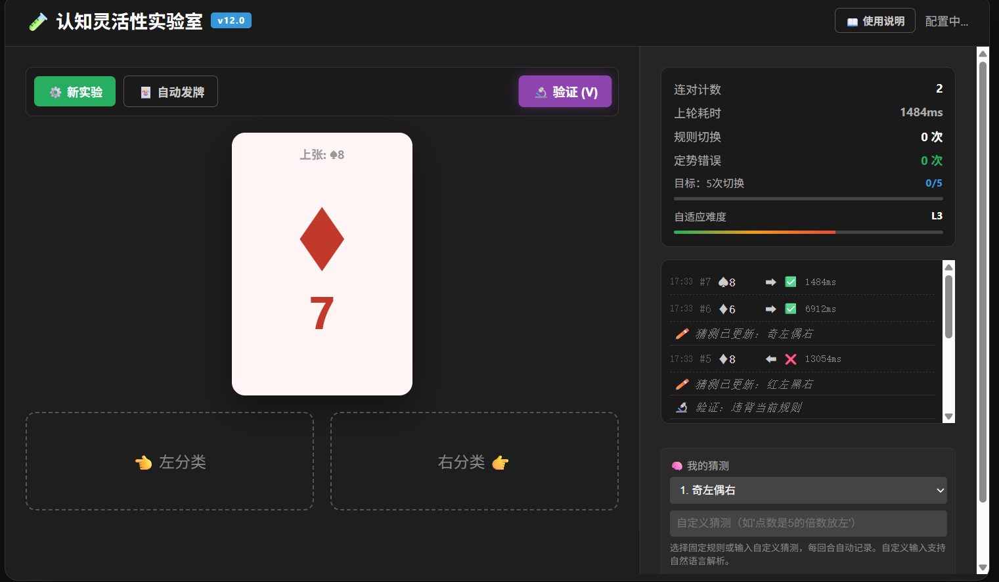

# 🧪 认知灵活性实验室 · Cognitive Flexibility Lab

> 一个基于经典威斯康星卡片分类任务（WCST）的深度认知训练工具。  
> 旨在通过自适应难度、噪声模拟和详尽的数据复盘，帮助您观察并提升自己的思维灵活性。

  
  
<em>软件主界面预览</em>

## ✨ 核心特色

- **🎯 自适应难度**：根据您的适应时间动态调整规则切换阈值（3–6次），始终让挑战与能力匹配。
- **🌪️ 噪声模拟**：可选 10% 的错误反馈，并支持三种提示强度（方向提示/中性提示/纯噪声），训练抗干扰能力。
- **🔬 主动验证模式**：连对 3 次后可主动出一张反例验证假设，不影响主流程，培养科学探索思维。
- **🧠 元认知追踪**：
  - 实时统计**持续性错误（思维定势）**次数，连续 3 次定势错误时按钮闪烁红光震动提醒。
  - 支持**猜测记录与自然语言解析**（如输入“红色且奇数放左”自动匹配规则），并在报告中统计猜测准确率。
- **📊 深度复盘报告**：
  - **核心指标**：正确率、平均反应时、适应时间、持续性错误率、规则切换次数。
  - **规则矩阵**：每条规则的出现次数、正确率、平均反应时及适应均时（颜色区分掌握程度）。
  - **规则段元认知分析**：对比每段规则内的出牌正确率与猜测准确率，标记“认知滞后”。
  - **时间轴**：彩色点阵可视化所有回合，鼠标悬停查看详情。
  - **规则切换链**：完整列出每一次规则切换及适应时间。
  - **审计日志**：逐条记录原始数据（牌面、选择、规则、反馈、噪声、猜测等），确保机制完全透明。
- **📈 历史趋势**：保存最近 20 次训练记录，绘制正确率、定势错误率、适应时间、反应时四曲线图，支持数据导入/导出（JSON/CSV），带悬浮 tooltip。
- **🎨 用户体验**：
  - 深色主题，手机端全面适配（响应式布局、触控优化）。
  - 专注模式（F 键隐藏右侧面板），退出按钮手机端底部固定/桌面端右上角。
  - 完整键盘快捷键（←/→ 放牌，V 验证，F 专注，Q 质询，ESC 退出专注）。

## 🚀 在线体验

无需安装，点击即用：  
**[👉 开始训练](https://cy-3-9.github.io/cognitive-lab/)**

## 📖 快速上手

1. 点击左上角 **⚙️ 新实验** 配置参数（新手建议直接使用默认的“阶段1”）。
2. 点击 **启动实验**，游戏开始。
3. 根据屏幕中央的扑克牌，点击下方 **👈 左分类** 或 **右分类 👉**（或使用键盘 ←/→）进行判断。
4. 每次判断后，屏幕中央会闪现 ✅ 或 ❌ 反馈（噪声时带 ?）。
5. 当连对计数达到 3 次时，**🔬 验证** 按钮激活，可用于检验假设（紫色反馈）。
6. 右侧面板可实时查看状态（连对计数、耗时、定势错误等）、日志，并记录您的猜测（支持自然语言）。
7. 点击 **⏹ 结束** 查看详细复盘报告。

详细说明请点击页面右上角的 **📖 使用说明**，内含完整的规则库、机制解读和常见问题。

## 🛠️ 配置与自定义

在配置弹窗中可调整以下参数：

| 参数 | 说明 |
|------|------|
| **自定义规则模式** | 手动勾选任意规则进行专项强化（至少选2项） |
| **训练阶段** | 预设四个难度阶段（入门/标准/进阶/大师） |
| **预设外卡规则** | 混入6条需上下文比较的规则 |
| **动态外卡** | 30%概率生成全新规则，规则空间无限 |
| **训练目标** | 设定完成5次切换/正确率≥80%/适应时间<2s |
| **概率噪声** | 开启后10%反馈被反转，可选三种提示强度 |
| **自动发牌** | 默认开启，也可手动选牌 |
| **快捷键提示** | 控制是否显示分类按钮上的键盘提示 |

## 📜 开源许可证

本项目采用 **MIT 许可证**。  
您可以自由使用、修改、复制本项目，但**必须保留原作者的版权声明**。

**版权所有 © 2025 虚玄**

## 🤝 贡献与反馈

如果您有任何建议或发现了 Bug，欢迎通过以下方式联系我：
- 在 GitHub 上提交 [Issue](https://github.com/cy-3-9/cognitive-lab/issues)

如果这个项目对您有帮助，欢迎点个 ⭐ 支持一下！

---

**认知灵活性实验室 v11.0 · 集科学性、透明性与可定制性于一体**
